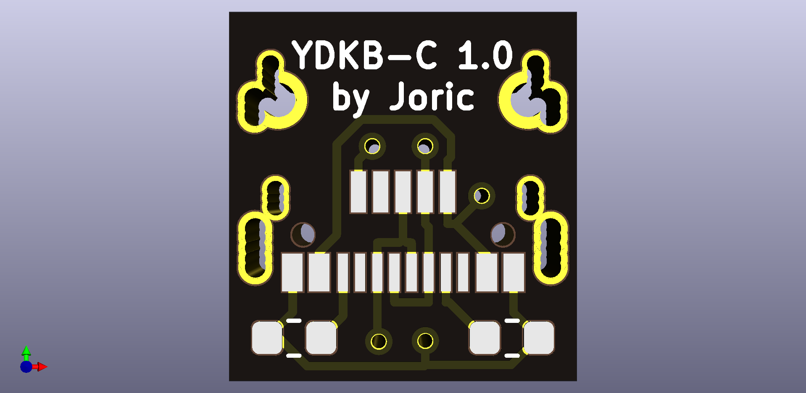
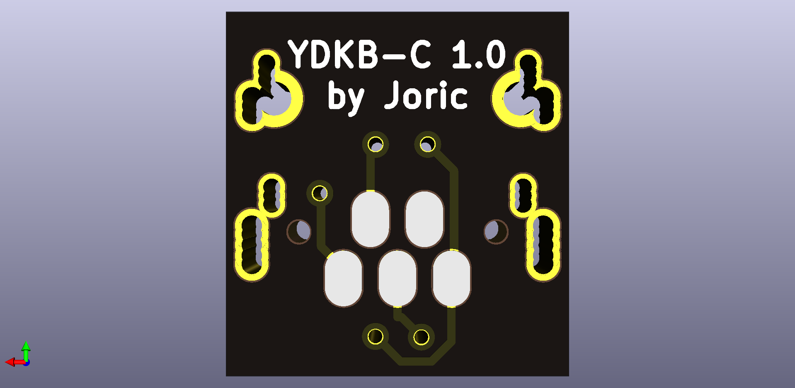

# USB-C

My collection of USB Type-C converter boards

## Documentation

See project wiki: https://github.com/joric/usb-c/wiki

## YDKB-C

YDKB HHKB BLE USB Type-C converter board

### Front

### Back

## References

* https://kbdfans.com/products/hhkb-ble-mod-upgrade-module
* [Alternative Controller for HHKB](https://geekhack.org/index.php?topic=12047.msg2842820#msg2842820) (geekhack)
* [HHKB BLE/USB Mod. No big ass. Nice look as original.](https://redd.it/be71vx) (reddit)
* [HHKB BLE MOD (Bluetooth 4.0 - YANG Module from KBDFAN)](https://redd.it/ct7h0w) (reddit)
* [USB type C connector board for TMK Alt HHKB board](https://github.com/manisteinn/usb-type-c-hhkb) (GitHub)

